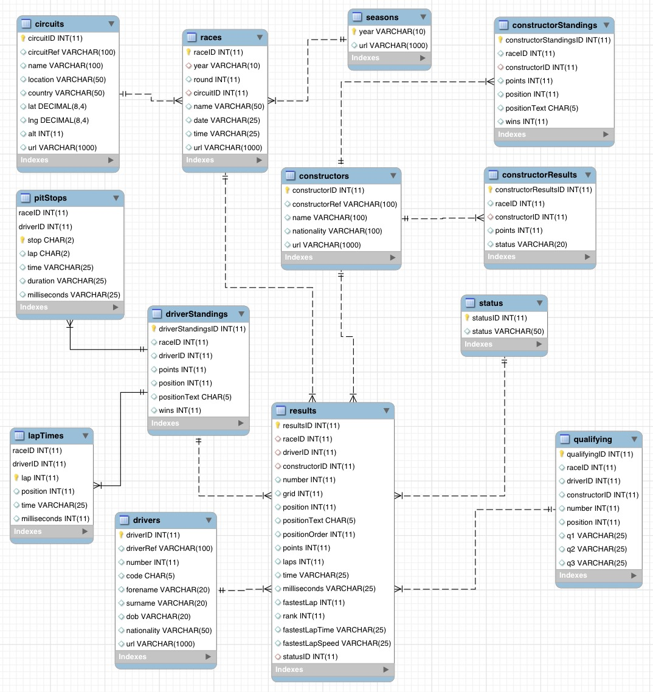
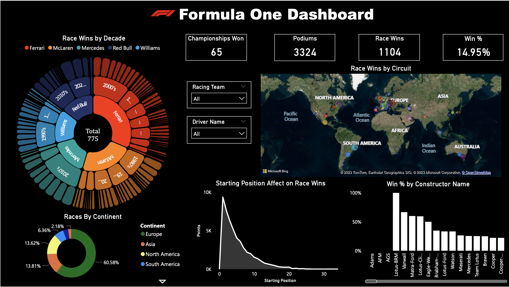

# Formula 1 Data Analysis with DBMS and Power BI Dashboard

# F1 Analytics Project

## Overview
This project utilizes a relational database management system (DBMS) to manage and analyze Formula 1 racing data. The data is loaded into SQL tables from various CSV files and then analyzed using SQL queries. A Power BI dashboard is used to visualize the results, providing insights into various aspects of Formula 1 races, such as driver standings, lap times, and race results.

## Directory Structure

```bash
F1-Analytics/
│── dataset/                   # Raw datasets in CSV format
│   ├── circuits.csv
│   ├── constructorResults.csv
│   ├── constructors.csv
│   ├── constructorStandings.csv
│   ├── drivers.csv
│   ├── driverStandings.csv
│   ├── lapTimes.csv
│   ├── pitStops.csv
│   ├── qualifying.csv
│   ├── races.csv
│   ├── results.csv
│   ├── seasons.csv
│   ├── sprint_results.csv
│   ├── status.csv
│── Snapshots/                 # Images and diagrams
│   ├── ERDiag.jpg             # Entity-Relationship Diagram
│   ├── F1-Dashboard.png       # Power BI Dashboard screenshot
│── SQLQuery/                  # SQL scripts for data analysis
│   ├── Analysis.sql           # SQL queries for insights
│   ├── script.sql             # SQL script for creating tables
│── .env                       # Environment configuration (ignored in Git)
│── .gitignore                 # Files to be ignored by Git
│── F1_Dashboard.pbix          # Power BI Dashboard file
│── README.md                  # Project documentation (this file)

```


## Dataset Description
The dataset consists of multiple CSV files that provide detailed information about Formula 1 races from various seasons. Below is a brief description of key datasets:

- **`circuits.csv`** - Details about race circuits (location, country, lat/lon, etc.).
- **`races.csv`** - Information about each race (date, circuit, year, etc.).
- **`drivers.csv`** - Driver details (name, nationality, birth date, etc.).
- **`constructors.csv`** - Constructor (team) details.
- **`results.csv`** - Race results, including finishing position, points, and status.
- **`qualifying.csv`** - Qualifying session times (Q1, Q2, Q3).
- **`pitStops.csv`** - Pit stop data per race.
- **`lapTimes.csv`** - Lap times per race and driver.
- **`driverStandings.csv`** - Driver standings across races.
- **`constructorStandings.csv`** - Constructor standings over races.
- **`constructorResults.csv`** - Constructor results in races.
- **`status.csv`** - Status of a race finish (finished, retired, etc.).

## Database Schema
The project follows a relational database schema, illustrated in the **ERDiag.jpg** file. Key relationships include:
- **`races`** table linking with **`circuits`**, **`results`**, **`qualifying`**, and **`pitStops`**.
- **`results`** table linking drivers, constructors, and race status.
- **`driverStandings`** and **`constructorStandings`** tracking seasonal progress.



## SQL Analysis
The **SQLQuery/** folder contains scripts used for data processing and querying:
- **`script.sql`** - Creates tables for loading data.
- **`Analysis.sql`** - Executes analytical queries to extract insights.

## Data Upload Notebook
The **`data_upload.ipynb`** notebook automates the process of loading CSV files into a database using Python.

## Dashboard
The Power BI Dashboard ([`F1_Dashboard.pbix`](https://app.powerbi.com/reportEmbed?reportId=03985f21-0a6c-4130-a8af-7e45cde70ee3&autoAuth=true&ctid=a8eec281-aaa3-4dae-ac9b-9a398b9215e7)) visualizes key insights such as:
- **Race wins by decade and constructor**
- **Race performance by circuit and continent**
- **Impact of starting position on race wins**
- **Driver and team statistics**



## How to Use

1. **Clone the repository**
  ```bash
  https://github.com/Vicky1240/F1-Analytics.git
  ```

2. **Configure Environment Variables**
   - Create a `.env` file in the root directory with following variables:
   ```env
   # MySQL connection details
   MYSQL_USERNAME = <your-username>
   MYSQL_PASSWORD = <your-password>
   MYSQL_HOST = <your-host>
   MYSQL_DATABASE = <your-database>
   ```

2. **Database Setup**
   - Run **`script.sql`** to create the database schema.
   - Load data from CSV files using the **`data_upload.ipynb`**.

3. **Data Analysis**
   - Use **`Analysis.sql`** to generate insights.

## Dependencies
- **SQL Database** (MySQL/PostgreSQL)
- **Python** (for data upload)
- **Power BI** (for visualization)
